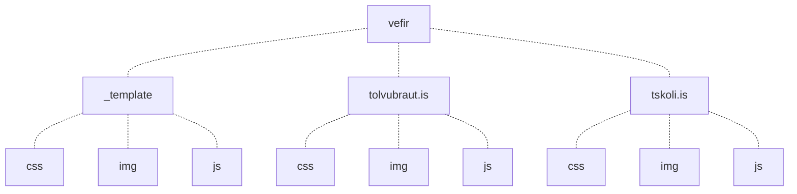
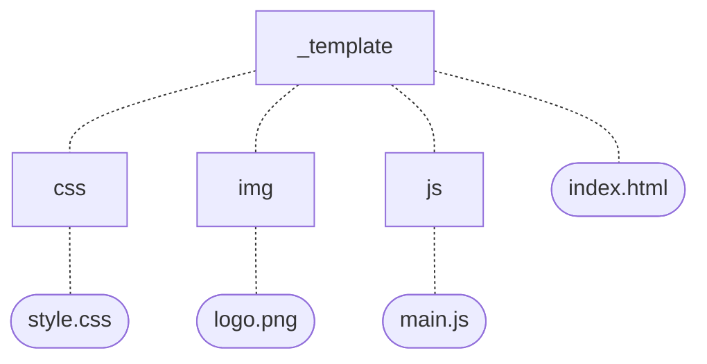

# Æfingaverkefni

Efni: Kaflar 7 og 8

### Búa til möppur

Búðu til eftirfarandi möppur í heimasvæðinu þínu.

Þú átt að geta gert allar möppurnar í einni og sömu skipuninni (sjá [hér](https://www.howtogeek.com/275069/how-to-create-multiple-subdirectories-with-one-linux-command/) ef þú þarft aðstoð).



:warning: Notaðu `tree` skipunina til að staðfesta að allar möppur hafi orðið til og á réttum stað.

### Búa til skrár

Færðu þig í `_template` möppuna og búðu til skrárnar hér fyrir neðan. Gerðu þær allar úr `_template` möppunni (skrárnar þurfa ekki að innihalda neitt).



:warning: Notaðu `tree` skipunina til að staðfesta að allar skrárnar hafi orðið til og á réttum stað.

### Afrita og færa

#### Færðu þig í `vefir` möppuna og gerðu allar eftirfarandi aðgerðir þaðan:

1. Afritaðu `index.html` skrána yfir í `tskoli.is` möppuna (notaðu *absolute path*).
1. Afritaðu `index.html` skrána yfir í `tolvubraut.is` möppuna (notaðu *relative path*).
1. Færðu `style.css` skrána yfir í `css` möppuna í `tskoli.is` (notaðu *relative path*).
2. Afritaðu `style.css` svo í `css` möppuna í `_template` (notaðu *relative path*).

#### Færðu þig núna í `tskoli.is/img` möppuna og gerðu eftirfarandi aðgerðir þaðan (notaðu *relative path*):

1. Afritaðu `logo.png` til þín. 
2. Afritaðu `logo.png` úr `_template/img` yfir í `tolvubraut.is/css`.
3. Færðu `logo.png` úr `tolvubraut.is/css` í `tolvubraut.is/img`.

#### Færðu þig núna í `template/js` möppuna og gerðu eftirfarandi aðgerð þar (notaðu *absolute path*):

1. Afritaðu `main.js` í `tskoli.is/js` möppuna.

#### Færðu þig núna í `tolvubraut.is/js` möppuna og gerðu eftirfarandi aðgerð þar (notaðu *relative path*):

1. Afritaðu `main.js` í `tolvubraut.is/js` frá `_template/js` möppunni.

#### Nýr "vefur"

Bættu við nýjum "vef" en í stað þess að búa til fullt af möppum og skrám ætlar þú að afrita `_template` möppuna með öllu sem er í henni í nýja möppu sem á að heita `skoli.is`. Kynntu þér rofana sem eru í boði að `cp` skipuninni til að leysa þennan lið.

### Lokin

Þegar allir liðir verkefnisins hafa verið gerðir ætti möpputréð þitt að líta svona út:

```bash
vefir
├── _template
│   ├── css
│   │   └── style.css
│   ├── img
│   │   └── logo.png
│   ├── index.html
│   └── js
│       └── main.js
├── skoli.is
│   ├── css
│   │   └── style.css
│   ├── img
│   │   └── logo.png
│   ├── index.html
│   └── js
│       └── main.js
├── tolvubraut.is
│   ├── css
│   ├── img
│   │   └── logo.png
│   ├── index.html
│   └── js
│       └── main.js
└── tskoli.is
    ├── css
    │   └── style.css
    ├── img
    │   └── logo.png
    ├── index.html
    └── js
        └── main.js
```
