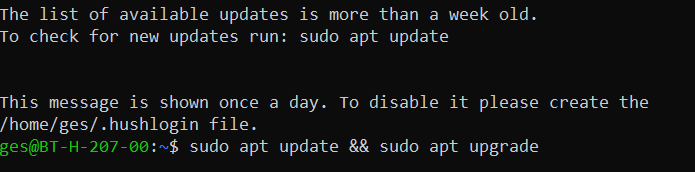

# Uppsetning á Ubuntu með Windows Subsystem for Linux

## Sjálfvirk uppsetning

Einfaldast er, ef hægt, að setja upp WSL með því að opna `Windows PowerShell (admin)` glugga í Windows og slá inn eftirfarandi: 

```powershell
wsl --install
```

:+1: Ef það virkar farðu þá [hingað](#uppsetning-á-notanda-í-ubuntu).

:-1: Ef það virkar ekki farðu þá eftir leiðbeiningunum um handvirka uppsetning.

## Handvirk uppsetning

Hægri smellið á Windows táknið og veljið **Apps and Features**


---

Í Apps and Features glugganum veljið **Programs and Features**. Ef Programs and Features sést ekki skrollið þá neðst í App and Features glugganum.


---

Veljið svo **Windows Features** í Programs and Features glugganum


---

Hakið svo við **Windows Subsystem for Linux**


---

Þegar uppsetningarferlinu er lokið **endurræsið tölvuna**

---

Þegar tölvan hefur verið endurræst á að opna **Microsoft Store** 

---

Leitið svo að **linux** og veljið **Ubuntu** 


---

Veljið svo að sækja **Ubuntu**


---

Það þarf **ekki** að skrá sig inn en þið megið gera það ef þið viljið


---

Næst þarf að niðurhala Ubunut


---

Þegar búið er að sækja Ubuntu þarf að ræsa það


## Uppsetning á notanda í Ubuntu

Það tekur smá stund fyrir Ubuntu að ræsa í fyrsta skipti


---

Þegar Ubuntu hefur klárað að ræsa þarf að búa sig til sem notanda. 

:warning: **Athuga** :warning:
- Notendanafn má ekki innihalda hástafi og má ekki byrja á tölustaf.
- Þegar lykilorðið er slegið inn birtast hvorki stafir né tákn, lykilorðið er samt lesið inn.


---

Þá er Ubuntu tilbúið til notkunar en áður en byrjað er að nota það er best að uppfæra það með því að gefa skipunina:

```bash
sudo apt update && sudo apt upgrade
```




