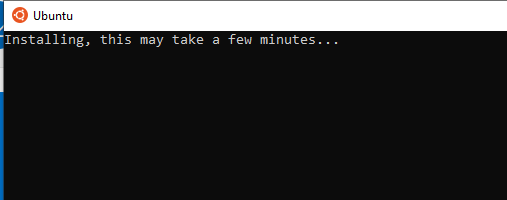
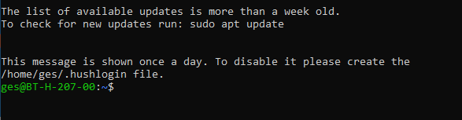

# Uppsetning á Ubuntu með Windows Subsystem for Linux

Hægri smellið á Windows táknið og veljið **Apps and Features**

---

Í Apps and Features glugganum veljið **Programs and Features**

---

Veljið svo **Windows Features** í Programs and Features glugganum

---

Hakið svo við **Windows Subsystem for Linux**

---

Þegar uppsetningarferlinu er lokið **endurræsið tölvuna**

---

Þegar tölvan hefur verið endurræst á að opna **Microsoft Store**

---

Leitið svo að **linux** og veljið **Ubuntu** 

---

Veljið svo að sækja **Ubuntu**

---

Það þarf **ekki** að skrá sig inn en þið megið gera það ef þið viljið

---

Næst þarf að niðurhala Ubunut

---

Þegar búið er að sækja Ubuntu þarf að ræsa það

---

Það tekur smá stund fyrir Ubuntu að ræsa í fyrsta skipti

---

Þegar Ubuntu hefur klárað að ræsa þarf að búa sig til sem notanda

---

Þá er Ubuntu tilbúið til notkunar

